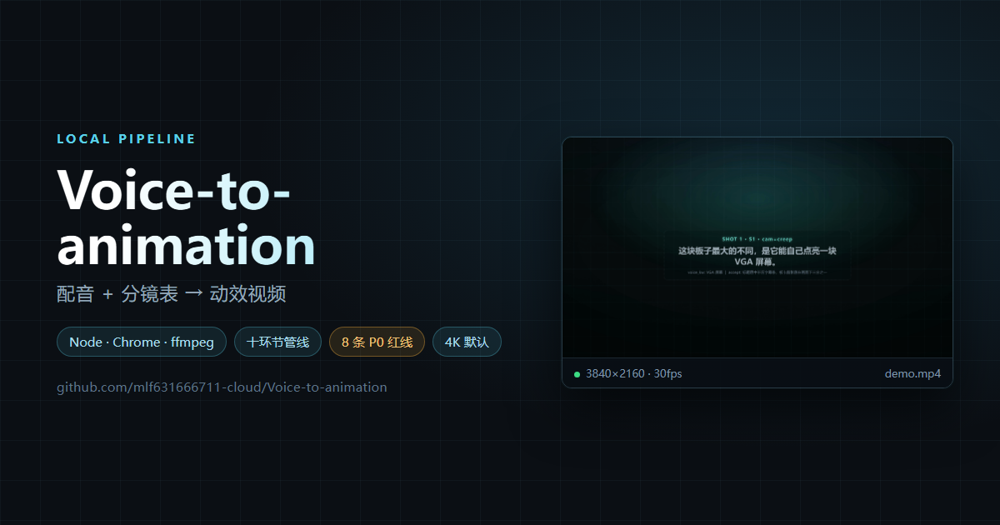

# 语音转动画 · Voice-to-animation

**中文** | [English](README.en.md)



> 把「一段配音 + 一份分镜表」变成「一条动效视频」的本地工具链。
> 纯 Node + 系统 Chrome + ffmpeg，**无云服务、无构建步骤、无框架绑定**。

---

## 这个仓库是什么

一套在生产里跑了几十轮、被真实交片验收过的工作流，连同它所有的工具和**踩坑记录**一起开源。

它不是"又一个视频框架"，而是三样东西：

| 内容 | 说明 |
|---|---|
| **一套方法** | 十个环节的管线，从配音进来、成片出去，每一步都有明确产物和过关标准 |
| **一套工具** | 40+ 个单文件脚本：脚手架生成器 / 渲染引擎 / 8 条红线门禁 / 配色选取 / 镜头卡检索 / 3D 摄影机 / 效果组件库 |
| **一套教训** | `docs/` 里的坑库与铁律，全都来自真实翻车（其中 **9 条典型缺陷里有 8 条是"零报错、判据全绿、画面是错的"**） |

> **适合谁**：想把口播/讲解类视频做成**动效视频**（而非 PPT 翻页）的剪辑师、独立开发者、小团队。
> **不适合谁**：想要"上传文案一键出片"的纯 SaaS 用户 —— 这里有命令行，且**最后一关必须用眼睛**。

---

## 核心思路（三条，决定了所有设计）

### 1. 画面时间轴由**配音的词轴**决定，不是估算

不是"每句话平均分"，而是转写出**逐词**时间（faster-whisper），元素的入场锚点直接绑到某个词的 `start`。

> 结果：语速变了、停顿变了，画面自动跟着走；不需要为了对齐画面去剪配音。

### 2. 动效写在**分镜表**里，而且是参数化的

每一镜必须填满六个运镜字段（`cam` / `cam_amp` / `cam_ease` / `camkeys` / `depth` / `accept`）——**缺一个，脚手架直接报错中止**。

> 结果：动效不是"看感觉调"，而是可检索、可复用、可交接的参数。

### 3. 交片前有**两道关**：机器门禁 + 人的眼睛

`trial.js` 跑 8 条 P0 红线（能跑 / 纯函数 / 遮罩 / 空帧 / 安全框 / 零报错 / 重叠 / 越界），退出码 0 才算可交。

**然后还有一关不能用任何工具替代**：把成片抽帧摊开，和页面预览做**同尺度 A/B** 逐像素比。

> 为什么不能省：本项目实测统计 —— **9 个典型缺陷里 8 个不会报错**。画面错了，判据照样全绿。

---

## 快速开始

```bash
# 1. 拿到工具
git clone https://github.com/mlf631666711-cloud/Voice-to-animation.git
cd Voice-to-animation

# 2. 自检环境 —— 缺什么它逐条告诉你装什么
#    （第一次跑通常会红几项，正常；它连中文字体有没有装都能验出来）
node kit/check_env.js

# 3. 按它说的装。Node 依赖只有这一个，可以自己跑：
npm i --no-save --no-package-lock puppeteer-core
#    ↑ 两个 flag 别省。本仓库**刻意不带 `package.json`**（零构建、全单文件脚本），
#      不加的话 npm 会当场给你造一个 package.json + lockfile 出来，`git status` 立刻变脏；
#    ★ 也可以让它替你装（先看计划，确认了再加 --yes）：
#      node kit/check_env.js --install         # 只打印要跑哪几条命令，一个字节不动
#      node kit/check_env.js --install --yes   # 真装，装完自动重跑自检

# 4. 再自检一次，全绿就能开工
node kit/check_env.js

# 5. 从样例分镜表生成一个可跑工程
#    ⚠️ 必须带 `--force` —— `examples/hello-voice` 已经在仓库里，
#       脚手架默认**不覆盖已有文件**，不给 `--force` 会在查重这一步直接退出（退出码 1）
node kit/new_project.js --spec kit/templates/spec.example.json --out examples/hello-voice --force

# 6. 渲染出片
cd examples/hello-voice
node _render.js          # → demo.mp4
```

> ⚠️ **`git clone` 不会自动装任何东西** —— 仓库里没有 `package.json`，所以
> `npm install` 也没得跑。环境是**手动一次性装好的**，第 2 步那条自检命令负责告诉你缺什么。

**期望输出**（步骤 5）：

```
[new_project] ✓ 生成完成
    · fx_demo.html  (58854 字节)
    · _render.js  (458 字节)
  镜头数  : 4   时长: 12s @ 30fps   1920x1080
```

> 这两个数是**字节数** —— 跟 `ls -l` / 资源管理器里看到的应当一致。
> `fx_demo.html` 那个是固定的（自包含，跟你在哪跑无关）；`_render.js` 会随你把工程生成到哪略变
> —— 它里面记着一条到 `kit/` 的相对路径。
> 如果你跑出来比这儿大 1000 多字节，多半是客户端 git 把换行符转成了 CRLF：
> 本仓有 `.gitattributes` 声明 `eol=lf` 来防这件事，遇到就检查一下它还在不在。

> 注意那个 `1920x1080` 是**设计画布尺寸**，不是最终输出 —— 往下看。

**期望输出**（步骤 6）：`demo.mp4`，**3840×2160 · 30fps · 361 帧 · 12.03s**。

> **为什么默认是 4K**：视口保持设计尺寸 1920×1080，用 `deviceScaleFactor=2` 让浏览器**按 2 倍光栅化**，
> 截图本身就是 3840×2160，再不做降采样 ⇒ 真 · 4K（DOM、文字、CSS 效果都是真像素放大）。
> **要 1080p**：在 `_render.js` 里加一行 `ss: 1`。
> ⚠️ **别用"把 w/h 改成 3840"来出 4K** —— 那会给按 1080p 设计的页面套一个 4K 外壳，
> 得到「4K 文件 + 左上角一张 1080p 画面」，**而文件尺寸判据照样 PASS**。

打开 `examples/hello-voice/fx_demo.html` 就能在浏览器里拖动时间轴逐帧看。

> ⚠️ **这个示例是骨架，不是成品** —— 每一镜都只有一句 `TODO` 占位（画面上的 `SHOT n · Sn · cam=xxx` 就是标记）。
> 所以**跑 `kit/trial.js` 会 FAIL，这是预期的**：它会报「无音轨」（示例不含配音）和「死帧段 / 最长死帧段 N.NNs」（每镜只有静态占位卡，镜内没有运动）。
> **那正好证明门禁是有牙的** —— 它没被一具空骨架骗过去。要出真片，得按 [`docs/SOP-故事地图.md`](docs/SOP-故事地图.md) 填进你自己的文案 / 配音 / 素材 / 分镜表。

> **跑不动？** 按顺序查：① `ffmpeg -version` 有没有输出 ② Chrome 装没装
> ③ puppeteer-core 解析不到 → 设 `RENDER_CORE_PUPPETEER=<你的 node_modules/puppeteer-core 绝对路径>`
> ④ 画面里文字是方块 → **中文字体没装**（见下方「环境依赖」）

---

## 管线：十个环节

每一步都有**产物**和**过关标准**，不是"大概做完了"。

| # | 环节 | 干什么 | 用什么 | 产物 |
|---|---|---|---|---|
| ① | 输入 | 写文案 | —— | 口播稿 |
| ② | 转写 | 配音 → **逐词**时间轴 | faster-whisper（medium 档） | `asr.json` |
| ③ | 判类型 | 9 类影片分类 | —— | 类型标签 |
| ③.5 | 配色 | 按类型取背景色 | `kit/palette_pick.cjs` | 色板 |
| ④ | 采素材 | 产品图 / B-roll / 音效 | —— | 素材目录 |
| ④.5 | 动效取材 | 选镜头 + 查术语 | `kit/shotcraft/pick.mjs` `term.mjs` | 选型表 |
| ⑤ | 写分镜表 | 每镜六字段 + 词轴锚点 | `kit/check_wording.js` | `spec.json` |
| ⑥ | 定参数 | 全局时长/画幅/帧率 | `kit/motion-tokens.js` | 配置 |
| ⑦ | 读坑库 | 动手前先看已知坑 | `docs/` | —— |
| ⑧ | 生成骨架 | 脚手架出工程 | `kit/new_project.js` | `fx_*.html` |
| ⑧.5 | 渲染 | 逐帧驱动 Chrome + ffmpeg 合成 | `kit/render-core.js` `kit/export-engine.js` | `*.mp4` |
| ⑨ | 审判 | 8 条 P0 红线 + 人眼 A/B | `kit/trial.js` | 退出码 0 |
| ⑩ | 归档 | 登记坑、清产物 | `kit/daily_archive.js` | 文档更新 |

> 完整的**人话版**流程（每一步"为什么非做不可"）见 `docs/SOP-故事地图.md`。
> **音效**（第 ④ 环的一部分）到哪下 → [`docs/音效获取指南.md`](docs/音效获取指南.md)。
> **素材采不到时**：可以自己画 SVG / 走 AI 生成。本项目本地维护了一套「素材生产班子」角色卡，
> 但**属可选项、不随本仓分发**（**额度消耗大** + 依赖本机库存）——
> 详见 [`docs/管线十环节.md`](docs/管线十环节.md) 的 ④ 采素材。

---

## 目录结构

```
Voice-to-animation/
├── kit/
│   ├── new_project.js          ★ 脚手架：分镜表 → 可跑工程（2D / 3D 两种骨架）
│   ├── render-core.js          ★ 渲染核心：puppeteer 逐帧驱动 + ffmpeg 合成（4K 可开）
│   ├── export-engine.js        ★ 导出引擎：取帧唯一真源，尺寸自证
│   ├── trial.js                ★ 总审判器：8 条 P0 红线，退出码 0 = 可交
│   ├── palette_pick.cjs          配色选取（9 种影片类型各一套取向）
│   ├── layout_check.js           版面检查（四边 / 字幕净空 / 重叠 / 元素数）
│   ├── boxchk.js                 安全框自检（含坐标系自检）
│   ├── contrast_check.js         对比度（Otsu + WCAG）
│   ├── check_wording.js          动画描述词校验（治"卡片飞进来"这类模糊话）
│   ├── carry_check.js            元素跨镜连续性检查
│   ├── daily_archive.js          每日归档守卫
│   ├── camera3d.js               ★ 3D 摄影机 · 几何层（lookAt / 轨道 / DOF / shake）
│   ├── camera-lens.js            ★ 3D 摄影机 · 光学层（镜头 + 胶片模拟 + 薄透镜 CoC）
│   ├── camera-shots.js           ★ 3D 摄影机 · 配方层（可链式运镜配方）
│   ├── fx-runtime.js             效果运行时（元素优先契约）
│   ├── fx-components.css         效果组件样式
│   ├── fx-uipack.js / .css       UI 效果包
│   ├── themes.js                 主题 / 色板
│   ├── motion-tokens.js          动效令牌（时长 / 曲线）
│   ├── transitions.js            转场库
│   ├── templates/                骨架模板 + 样例分镜表
│   └── shotcraft/                镜头卡 157 张 + 动效术语库 558 条（含检索器）
├── docs/
│   ├── SOP-故事地图.md            ★ 全流程 checklist（打印出来打勾那种）
│   ├── 管线十环节.md              每步的产物与过关标准
│   ├── 出片铁律.md                ⛔ 红线：违反就返工
│   ├── 环境与依赖.md              装什么、怎么装、怎么验
│   └── 坑库.md                    真实翻车记录（症状 → 真因 → 修法 → 证据）
├── examples/
│   └── hello-voice/              一个能直接跑通的示例工程
└── LICENSE
```

---

## 环境依赖

| 依赖 | 版本 | 用途 | 为什么是它 |
|---|---|---|---|
| **Node.js** | 18+ | 跑所有工具 | 全部是单文件脚本，**不需要构建、不需要 npm install 整个仓库** |
| **Python** | 3.11+ | 转写 + 图像分析 | faster-whisper / numpy / Pillow |
| **Google Chrome** | 任意近期版 | 渲染引擎 | 走**系统 Chrome + puppeteer-core**，不下载额外 Chromium |
| **ffmpeg** | 5+ | 合成 / 抽帧 | 合成、抽帧、度量都用它 |
| **中文字体** | —— | 画面文字 | ⚠️ **字体不进仓库**（体积 + 授权），必须自己装 |

```bash
# Node 依赖（只有这一个）
#   --no-save --no-package-lock：本仓库不带 package.json，加这两个 flag 才不会凭空造一个
npm i --no-save --no-package-lock puppeteer-core

# Python 依赖
pip install faster-whisper numpy Pillow

# 验证
node -v && python -V && ffmpeg -version | head -1
```

> **字体**：推荐开源可商用的 **思源黑体（Source Han Sans）** 或 **阿里巴巴普惠体**。
> 不装字体的后果：画面文字全部变方块 —— **而且所有判据都不会报错**。

---

## 出片铁律

这些不是"建议"，是**违反就要返工**的红线。全部来自真实翻车。

| # | 铁律 | 为什么 |
|---|---|---|
| 1 | **成片时长 = 配音时长 + 1.0s**，实测差 \|Δ\| ≤ 0.02s | 末尾留一口气；时长猜的必然对不上 |
| 2 | ⛔ **合成禁用 `-shortest`** | 实测会少 4 帧（349 vs 353），**末尾画面静止而人声还在播** |
| 3 | 双版本（无音效/有音效）：**画面只渲一次**，第二版 `-c:v copy` 换音频 | 省一半时间，且保证两版画面逐帧一致 |
| 4 | 字幕净空：安全框内元素底边 **≤ 880px**（1080p） | 字幕区从 y=900 起，压上去就糊 |
| 5 | 入场用 `easeOutBack`，位移延展只用 `linear`，**其余禁用 linear** | linear 入场看着像卡顿 |
| 6 | **末段零定版**：末镜动作演到片尾，不做冻结 | 冻结会让尾段塌成静帧 |
| 7 | 判据必须**有牙**：故意做错一次，看它会不会红 | 不变红的判据是摆设，它的绿不能信 |
| 8 | 交付前**必须**换一个没参与制作的人二审（8 维 ≥90） | 自己做的东西，自己看不出来 |

---

## 音效去哪找

本仓库**不含任何音频**（授权 + 体积两个原因）。要加音效的话，去下面这些站点自己下 ——
**全部免费可商用**，且免署名、免注册，直接能用在商业片子里：

| 站点 | 规模 | 许可 | 适合 |
|---|---|---|---|
| [**Pixabay**](https://pixabay.com/sound-effects/) | 70,000+ | Pixabay Content License | 转场音 / whoosh / impact / UI 音，下载即用 |
| [**Mixkit**](https://mixkit.co/free-sound-effects/) | ~2,000+ | Mixkit Free License | 短视频向，分类清爽 |
| [**Kenney**](https://kenney.nl/assets?q=audio) | 10 个音频包 | **CC0** | 一整套风格统一的 UI / 打击音 |
| [**Sonniss GDC Bundle**](https://gdc.sonniss.com/) | 每年 7~27 GB | Sonniss Royalty-Free | 影视级、量大，一次下几个 GB |
| [**Freesound**](https://freesound.org/) | 730,000+ | **逐条不同** | ★ **必须只筛 CC0**（见下） |

⚠️ **两个会翻车的坑**：

1. **Freesound 是一个许可混装池** —— `CC0` / `CC BY`（要署名）/ `CC BY-NC`（**禁止商用**）混在一起。
   商用片子里用了 NC 的素材 = 侵权，肉眼看不出来。**搜索时把许可筛成 CC0**。
2. **BBC Sound Effects 不能商用** —— 库很大很香，但许可仅限个人 / 教育 / 研究。
   另外「免费下载」≠「可商用」，看清**该文件自己的条款**，别信站点首页。

⛔ 还有一条：**下载的音效别提交进仓库** —— 多数站点明确禁止「把原始文件作为独立素材再分发」。
（`.gitignore` 已默认忽略 `assets/` 与 `*.wav`。）

**下完怎么用**：放进工程的 `audio/sfx/`，分镜表里写 `"sfx": [3.18, "whoosh"]` 锚点；
增益不用手调 —— 贴点表里写目标峰值 `peak`，混音脚本会量素材自动定增益。
完整指引（站点详表 · 贴点表格式 · 双版本出片命令）→ **[`docs/音效获取指南.md`](docs/音效获取指南.md)**

---

## 常见问题

**Q：一定要用命令行吗？**
管线本身是命令行的（因为要精确控制逐帧）。但如果你只需要**一屏参数讲解**这种版式（俗称"预设模板"），作者另外做了一个**双击即用的桌面软件**（Electron 便携版）。那是**独立项目**，不随本仓库分发 —— 所以这里只说明它存在，不提供下载。

**Q：输出多大？怎么调？**
默认 **3840×2160（真 4K）**，`ss=2` 超采样。降到 1080p：`_render.js` 里加 `ss: 1`。
代价参考：4K 每帧 PNG 0.2~7.6 MB，长片建议开 `--pipe`（PNG 走 stdin、不落盘）。

**Q：为什么 `w:1920` 出来的却是 4K？**
因为 `w/h` 描述的是**设计画布**，4K 是靠 `deviceScaleFactor`（超采样）实现的，不是靠改画布尺寸。
这个护栏是特意的：如果你**显式**传一个 ≥2048 的 `w`，核心会认为你要的就是那个输出尺寸，自动不再叠超采样 —— 免得 `--w 3840` 变成 7680。

**Q：为什么不用 Remotion / After Effects 这类现成方案？**
因为核心需求是「**画面时间轴绑死配音词轴**」+「**交片前可机器验、可人眼查**」。Remotion 更适合组件式编程渲染，AE 不可机器审。这里是另一条路：单文件 HTML 工程 + 逐帧驱动 + 判据体系。（AE 表达式和 Remotion 也在本项目的其它子项目里用，不冲突。）

**Q：`docs/坑库.md` 里的坑我都没遇到，是不是可以跳过？**
可以。但建议至少读一遍第一条 —— **"起播遮罩没隐藏 ⇒ 成片一片白、零报错"**，那是最高频的一击。

---

## 许可证

[MIT](LICENSE) —— 工具代码可自由使用、修改、商用。

⚠️ **注意**：仓库**不包含**任何中文字体、产品素材、商业 B-roll。
自带素材的授权请自行确认（尤其商用场景）。

### 第三方与致谢

本仓库**唯一**随仓分发的第三方内容是**镜头卡库**，来自
**[`Vincentwei1021/video-shotcraft`](https://github.com/Vincentwei1021/video-shotcraft)**
（作者 **Wei Yihao** · **Apache-2.0** · 10k+ stars）：

- 它的 **157 张镜头卡知识**被解析成 [`kit/shotcraft/index.json`](kit/shotcraft/index.json)（字段重排 + 加中文字段 + 派生标记）
- **我们做了哪些修改**（Apache-2.0 §4(b) 要求的声明）→ 见 **[`THIRD-PARTY.md`](THIRD-PARTY.md)**
- 许可副本 → [`licenses/video-shotcraft-LICENSE.txt`](licenses/video-shotcraft-LICENSE.txt)

**不随本仓分发**：上游的卡片原文、Remotion 代码、214 个样片视频（131 MB）、音频（36 MB，Mixkit 许可）——
本仓库只带**已解析好的索引成品**（检索与选型要用的字段都在里面）。
想读卡片原文、或想自己重建索引，直接 clone 上游即可；想看样片走上游的在线 Gallery：
<https://vincentwei1021.github.io/video-shotcraft/>

完整清单（含 `puppeteer-core` / FFmpeg / Chrome / Remotion / Mixkit 各自的许可提醒）
见 **[`THIRD-PARTY.md`](THIRD-PARTY.md)**。

---

## 相关

- 本项目提炼自一条真实生产线的实践，包含 2000+ 条实测缺陷记录的沉淀
- 文档里的每条铁律，都能追溯到一次具体的翻车

> **一句话**：这套东西的价值不在于它生成了视频，而在于它**承认"判据会骗人"，并为此留了一关必须用眼睛**。
